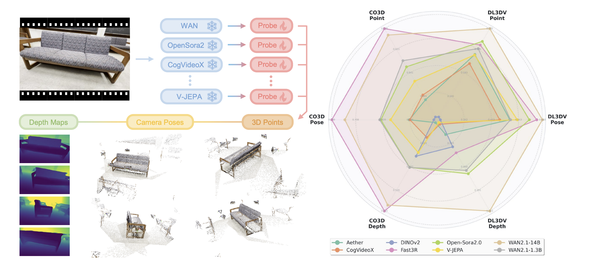

# probe_spatial: Probing Spatial Understanding in Video Foundation Models

This repository extends [VidFM3D](https://github.com/zxhuang1698/VidFM3D) with a **Spatial Diagnostic Suite** — four orthogonal probes that together characterize what kind of 3D / temporal / ego-centric understanding a Video Foundation Model (VFM) has internalized, all trained on frozen VFM features without touching VFM weights.

| Family | Probe | Question |
|--------|-------|---------|
| **A. Global Spatial Perception** | A1 depth/camera/identity (VidFM3D baseline) | Does the VFM perceive a coherent 3D scene? |
| **A. Global Spatial Perception** | **A2 view consistency** | Can it tell whether two clips share a viewing region? |
| **A. Global Spatial Perception** | **A3 abnormal detection** | Can it detect temporally shuffled frames? |
| **B. Ego-Centric Belief** | **B1 hidden-object localization** | Does it remember where objects went off-screen? |
| **C. Action-Conditioned Prediction** | **C1 latent dynamics** | Can it predict the next-frame feature given a camera motion? |

Based on: [VidFM3D: How Much 3D Do Video Foundation Models Encode?](https://arxiv.org/pdf/2512.19949v1)



---

## Quick-start: reproduce results on a new server

```bash
# 1. Clone repo
git clone https://github.com/yyyybq/probe_spatial.git
cd probe_spatial

# 2. Create env (see Installation section below)
conda create -n vidfm3d python=3.11 cmake=3.14.0 -y
conda activate vidfm3d
conda install pytorch torchvision torchaudio pytorch-cuda=12.4 \
    nvidia/label/cuda-12.4.0::cuda-toolkit -c pytorch -c nvidia
pip install "git+https://github.com/facebookresearch/pytorch3d.git@stable" --no-build-isolation
pip install -r requirements.txt
pip install -e .

# 3. Download InsScene-15K data
python data/download_inscene15k.py --step all --base-dir /data/InsScene-15K

# 4. Extract VFM features (one VFM shown; repeat for cogvideox / vjepa2)
INSCENE_DATA=/data/InsScene-15K
python -m features.run_inscene15k --vfm wan \
    --model-id Wan-AI/Wan2.1-T2V-1.3B-Diffusers \
    --data-root ${INSCENE_DATA}/data --out-root ${INSCENE_DATA}/FEAT \
    --t 749 --output-layers 20
python -m features.run_inscene15k --vfm wan --mode shuffled \
    --model-id Wan-AI/Wan2.1-T2V-1.3B-Diffusers \
    --data-root ${INSCENE_DATA}/data --out-root ${INSCENE_DATA}/FEAT_SHUFFLED \
    --t 749 --output-layers 20
python -m features.run_inscene15k --vfm wan --mode target_isolated \
    --model-id Wan-AI/Wan2.1-T2V-1.3B-Diffusers \
    --data-root ${INSCENE_DATA}/data --out-root ${INSCENE_DATA}/FEAT_TARGET \
    --t 749 --output-layers 20 --num-targets 8

# 5. Train all 4 new probes for Wan on GPU 0
bash scripts/run_diag_sweep.sh wan 0

# 6. Test & evaluate
bash scripts/run_diag_eval_sweep.sh   # writes comparison_val.csv
```

> **Note**: feature paths are hardcoded in `configs/experiment/inscene15k_ext/*.yaml`.
> Update the `root_vfm`, `target_feat_root`, and `shuffled_feat_root` fields to match
> your actual data location before training, or pass overrides via Hydra:
> ```bash
> python vidfm3d/train.py experiment=inscene15k_ext/action_dynamics_wan_v1 \
>     model.probe.target_feat_root=/data/InsScene-15K/FEAT_TARGET
> ```

---

## Installation

```bash
conda create -n vidfm3d python=3.11 cmake=3.14.0 -y
conda activate vidfm3d

# PyTorch (CUDA 12.4)
conda install pytorch torchvision torchaudio pytorch-cuda=12.4 \
    nvidia/label/cuda-12.4.0::cuda-toolkit -c pytorch -c nvidia

# PyTorch3D (takes a while to compile; set MAX_JOBS=4 on low-RAM machines)
pip install "git+https://github.com/facebookresearch/pytorch3d.git@stable" --no-build-isolation

pip install -r requirements.txt
pip install -e .
```

<details>
<summary>Troubleshooting</summary>

**CUDA Runtime Error** — `fatal error: cuda_runtime.h: No such file or directory`
```bash
export CUDA_HOME=/usr/local/cuda-12.4
pip install "git+https://github.com/facebookresearch/pytorch3d.git@stable"
```

**PyTorch iJIT_NotifyEvent** — Intel MKL incompatibility:
```bash
conda install "mkl<2024.1" "intel-openmp<2024.1" -c conda-forge -y
```

**GCC too new for CUDA** — Set `CC`/`CXX` to an older GCC or install one into the conda env before building PyTorch3D.

</details>

---

## Dataset Preparation

### InsScene-15K (primary dataset)

InsScene-15K ([HuggingFace: lifuguan/InsScene-15K](https://huggingface.co/datasets/lifuguan/InsScene-15K)) combines **Infinigen** synthetic scenes and **ScanNet++** real-world scenes.

```bash
# Download + extract in one step (~60 GB)
python data/download_inscene15k.py --step all --base-dir /data/InsScene-15K

# Or separately
python data/download_inscene15k.py --step download --base-dir /data/InsScene-15K
python data/download_inscene15k.py --step extract  --base-dir /data/InsScene-15K
```

Expected structure after extraction:
```
/data/InsScene-15K/
  data/
    processed_infinigen/      # Infinigen synthetic scenes
    processed_scannetpp_v2/   # ScanNet++ real-world scenes
  FEAT/                       # filled by feature extraction (step 4)
  FEAT_SHUFFLED/              # filled by feature extraction --mode shuffled (A3)
  FEAT_TARGET/                # filled by feature extraction --mode target_isolated (C1)
```

### CO3Dv2 / DL3DV (original VidFM3D datasets)

Follow the [original VidFM3D instructions](https://github.com/zxhuang1698/VidFM3D#dataset-preparation) for CO3Dv2 and DL3DV.

---

## Feature Extraction

Features are pre-extracted once and cached as `.sft` files. The extractor is resume-safe (skips already-done scenes).

### InsScene-15K — three extraction modes

| Mode | Output dir | Used by |
|------|-----------|---------|
| `normal` (default) | `FEAT/` | A1, A2, B1, C1 input |
| `shuffled` | `FEAT_SHUFFLED/` | A3 (temporally shuffled clips) |
| `target_isolated` | `FEAT_TARGET/` | C1 target features (no temporal context) |

```bash
INSCENE_DATA=/data/InsScene-15K
VFM=wan
MODEL_ID=Wan-AI/Wan2.1-T2V-1.3B-Diffusers

# Normal features (required for all probes)
python -m features.run_inscene15k --vfm ${VFM} --model-id ${MODEL_ID} \
    --data-root ${INSCENE_DATA}/data --out-root ${INSCENE_DATA}/FEAT \
    --t 749 --output-layers 20

# Shuffled features (A3 only)
python -m features.run_inscene15k --vfm ${VFM} --model-id ${MODEL_ID} \
    --mode shuffled \
    --data-root ${INSCENE_DATA}/data --out-root ${INSCENE_DATA}/FEAT_SHUFFLED \
    --t 749 --output-layers 20

# Target-isolated features (C1 only)
python -m features.run_inscene15k --vfm ${VFM} --model-id ${MODEL_ID} \
    --mode target_isolated \
    --data-root ${INSCENE_DATA}/data --out-root ${INSCENE_DATA}/FEAT_TARGET \
    --t 749 --output-layers 20 --num-targets 8
```

Switch `--vfm cogvideox --model-id THUDM/CogVideoX-5b-I2V` or
`--vfm vjepa2` (uses `features/vjepa2/vjepa2_feature.py`) for other VFMs.

| VFM | `--vfm` | `--model-id` | `feat_postfix` | `in_channels` |
|-----|---------|-------------|---------------|--------------|
| Wan2.1-T2V-1.3B | `wan` | `Wan-AI/Wan2.1-T2V-1.3B-Diffusers` | `_t749_layer20` | 1536 |
| CogVideoX-5B | `cogvideox` | `THUDM/CogVideoX-5b-I2V` | `_t749_layer20` | 3072 |
| V-JEPA2-ViT-L | `vjepa2` | see `features/vjepa2/` | `_layer23` | 1024 |

---

## Training

### New Diagnostic Probes (A2 / A3 / B1 / C1) — this work

**Train all four probes for one VFM on a single GPU:**
```bash
bash scripts/run_diag_sweep.sh wan     0   # GPU 0
bash scripts/run_diag_sweep.sh vjepa2  1   # GPU 1
bash scripts/run_diag_sweep.sh cogvideox 2 # GPU 2
```

**Train a single probe:**
```bash
# A2 view consistency
CUDA_VISIBLE_DEVICES=0 python vidfm3d/train.py \
    experiment=inscene15k_ext/view_consistency_wan_v1

# A3 abnormal detection
CUDA_VISIBLE_DEVICES=0 python vidfm3d/train.py \
    experiment=inscene15k_ext/abnormal_wan_v1

# B1 hidden-object localization
CUDA_VISIBLE_DEVICES=0 python vidfm3d/train.py \
    experiment=inscene15k_ext/ego_belief_wan_v1

# C1 latent dynamics
CUDA_VISIBLE_DEVICES=0 python vidfm3d/train.py \
    experiment=inscene15k_ext/action_dynamics_wan_v1
```

Training runs for 50 epochs (≈2–4 hours per probe on 1× L40S), auto-resumes from `last.ckpt`.

**Control experiments** (scrambled features as baseline):
```bash
CUDA_VISIBLE_DEVICES=0 python vidfm3d/train.py \
    experiment=inscene15k_ext/action_dynamics_wan_ctrl
```

### A1 Baseline Probe (depth / camera / identity) — original VidFM3D

```bash
# Wan2.1
CUDA_VISIBLE_DEVICES=0 python vidfm3d/train.py experiment=inscene15k/wan_probe_v3

# V-JEPA2
CUDA_VISIBLE_DEVICES=1 python vidfm3d/train.py experiment=inscene15k/vjepa2_probe_v3
```

Trains for 100 epochs, checkpointed every 5 epochs.

### Override data paths

If your data is not at the default path, override via Hydra:
```bash
python vidfm3d/train.py experiment=inscene15k_ext/action_dynamics_wan_v1 \
    "data.data_module.train_datasets=['InsScene15KDataset(root=\"/your/data\", root_vfm=\"/your/FEAT\", ..., diag_action=True, target_feat_root=\"/your/FEAT_TARGET\")']"
```

---

## Evaluation

### New Diagnostic Probes (A2 / A3 / B1 / C1)

```bash
# Evaluate all trained runs and aggregate into a CSV
bash scripts/run_diag_eval_sweep.sh     # writes comparison_val.csv

# Evaluate a single run
python vidfm3d/eval_diag.py \
    experiment=inscene15k_ext/view_consistency_wan_v1 \
    ckpt_path=logs/<run>/checkpoints/last.ckpt \
    eval_split=val train=false test=false
```

**Test mode** (final numbers, runs the test dataloader):
```bash
# Using a symlink to avoid Hydra=sign parsing issue
ln -s logs/<run>/checkpoints/epoch=49-step=104850.ckpt /tmp/eval_ck.ckpt
python vidfm3d/train.py experiment=inscene15k_ext/action_dynamics_wan_v1 \
    train=False test=True ckpt_path=/tmp/eval_ck.ckpt \
    data.data_module.batch_size_per_device=16 \
    data.data_module.batch_size_per_device_val=16
```

> **Tip**: Use `batch_size=16` for test to avoid nan in C1 R@1 (the last batch
> must have ≥ 4 samples; 953 val samples % 16 = 9 ✓).

### A1 Baseline Probe

```bash
# Evaluate depth, camera (Auc_30, Rac_15, Tac_15), and identity
python eval_pertask_v3.py --models wan,vjepa2 --gpu 0
```

Results summary (InsScene-15K val, 953 samples):

| Model | depth↓ | identity↓ | Auc_30↑ | Rac_15↑ | Tac_15↑ |
|-------|--------|-----------|---------|---------|---------|
| Wan2.1 | 0.334 | 5.550 | 1.76% | 7.49% | 7.22% |
| V-JEPA2 | 0.322 | 4.628 | 2.15% | 7.97% | 7.43% |

### New Probe Results Summary

| Probe | Wan v1 | Wan ctrl | V-JEPA2 v1 | Note |
|-------|--------|----------|-----------|------|
| A2 overlap_acc↑ | 85.6% | 78.7% | 85.2% | trivial baseline=84.3% |
| A3 pair_acc↑ | 86.3% | 16.5% | pending re-eval | Wan numbers after dtype/seed fixes |
| B1 az_err↓ | 18.1° | 23.4° | 17.6° | |
| B1 el_err↓ | 11.4° | 15.1° | 11.7° | |
| C1 R@1↑ | 26.7% | 5.8% | 22.8% | random=6.25% |

---

## Repository Structure

```
probe_spatial/
├── data/
│   └── download_inscene15k.py       # Download + extract InsScene-15K
├── configs/
│   ├── train.yaml                   # Hydra top-level config
│   ├── model/
│   │   ├── probe.yaml               # A1 probe (depth/camera/identity)
│   │   └── probe_ext.yaml           # NEW: A2/A3/B1/C1 probes
│   └── experiment/
│       ├── inscene15k/              # A1 experiments
│       └── inscene15k_ext/          # NEW: 4 probes × 3 VFMs + ctrl variants
├── features/
│   ├── run_inscene15k.py            # Feature extractor (normal/shuffled/target modes)
│   ├── wan/                         # Wan feature extraction
│   ├── cogvideox/                   # CogVideoX feature extraction
│   └── vjepa2/                      # V-JEPA2 feature extraction
├── vidfm3d/
│   ├── train.py                     # Hydra entry point
│   ├── eval_diag.py                 # Per-sample dump for diagnostic probes
│   ├── eval_diag_compare.py         # Aggregate runs into CSV
│   ├── data/components/
│   │   └── inscene15k_dataset.py    # Dataset (extended with diag flags)
│   ├── models/
│   │   ├── probe_ext_module.py      # NEW: LitModule for A2/A3/B1/C1
│   │   └── components/
│   │       ├── probe_view_consistency.py   # A2 head
│   │       ├── probe_abnormal.py           # A3 head
│   │       ├── probe_ego_belief.py         # B1 head
│   │       └── probe_action_dynamics.py    # C1 head
│   └── utils/
│       └── spatial_diag.py          # Geometry helpers (overlap, polar, pose)
├── scripts/
│   ├── run_diag_sweep.sh            # Train all 4 probes for one VFM
│   └── run_diag_eval_sweep.sh       # Eval all runs, write CSV
└── eval_pertask_v3.py               # A1 evaluation script
```

---

## Known Issues & Fixes

**PyTorch 2.6 `weights_only` error on checkpoint resume**
`torch.load` defaults to `weights_only=True` in PyTorch 2.6+, which breaks Lightning checkpoint loading with OmegaConf objects. Fixed in `vidfm3d/train.py` via monkeypatch.

**`last.ckpt` not updating when val/loss plateaus**
Fixed in `vidfm3d/train.py` via monkeypatch that unconditionally saves `last.ckpt` every epoch.

**Hydra parse error with `=` in checkpoint path**
`epoch=49-step=104850.ckpt` contains `=` which confuses Hydra's CLI parser. Workaround: symlink to `/tmp/eval_ck.ckpt` first.

**C1 R@1 = nan in test mode**
Happens when the last batch has < 4 samples. Fix: use `batch_size_per_device=16` (953 % 16 = 9 ≥ 4).

---

## CO3Dv2 and DL3DV (original VidFM3D datasets)

<details>
<summary>Expand</summary>

### Dataset Preparation

**CO3Dv2:**
```bash
python -m vidfm3d.data.processing.co3d.extract_frames \
    --raw_root vidfm3d/data/CO3D/CO3D-data \
    --out_root vidfm3d/data/CO3D/CO3D-raw \
    --stride 1 --num_frames 81 --trunc_thresh 0.25 --resize_to 960 540
python -m vidfm3d.data.processing.process_co3d --root vidfm3d/data/CO3D
```

**DL3DV:**
```bash
python -m vidfm3d.data.processing.process_dl3dv --root vidfm3d/data/DL3DV
```

### Feature Extraction
```bash
python -m features.run_co3d  --vfm wan --model-id Wan-AI/Wan2.1-T2V-1.3B-Diffusers --output-layers 20 --t 749
python -m features.run_dl3dv --vfm wan --model-id Wan-AI/Wan2.1-T2V-1.3B-Diffusers --output-layers 20 --t 749
```

### Training
```bash
python vidfm3d/train.py experiment=co3d/wan job_name=wan
python vidfm3d/train.py experiment=dl3dv/wan job_name=wan
```

### Evaluation
```bash
python scripts/parse_results.py \
    --groups dl3dv,co3d --runs wan \
    --metrics "val/Auc_30,val/pmap_mse_aligned,val/loss_depth"
```

</details>

---

## Citation

```bibtex
@article{huang2025vidfm3d,
  title   = {How Much 3D Do Video Foundation Models Encode?},
  author  = {Huang, Zixuan and Li, Xiang and Lv, Zhaoyang and Rehg, James M.},
  booktitle = {arXiv preprint arXiv:2512.19949},
  year    = {2025}
}
```

## Acknowledgments

This project builds on:
- **[VidFM3D](https://github.com/zxhuang1698/VidFM3D)** — original probing framework (MIT)
- **[Fast3R](https://github.com/facebookresearch/fast3r)** — training & data infrastructure
- **[VGGT](https://github.com/facebookresearch/vggt)** — architecture and data processing

Foundation models evaluated: **Wan 2.1**, **CogVideoX**, **V-JEPA2** (each under its own license).
